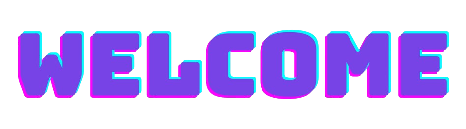

  

<h1 align="center">Michele Andrade</h1>

<h3 align="center">
  Full Stack Developer • React • Next.js • TypeScript • Node.js • NestJS • Generative AI
</h3>

  Desenvolvo aplicações web, produtos SaaS, APIs e sistemas corporativos,
  conectando tecnologia, experiência do usuário e regras de negócio.

  
  
  

---

## 👩🏻‍💻 Sobre mim

Sou **Desenvolvedora Full Stack** com experiência no desenvolvimento e evolução de aplicações web, produtos digitais, dashboards, APIs e sistemas corporativos.

- 💻 Atuo no frontend e backend com **React, Next.js, TypeScript, Node.js e NestJS**
- 🧩 Participo da análise de requisitos, regras de negócio, desenvolvimento, integração e evolução das aplicações
- 🗄️ Trabalho com bancos relacionais, utilizando **PostgreSQL, MySQL e SQL Server**
- ☁️ Tenho experiência com **AWS, Docker, VPS, deploy e integração entre sistemas**
- 🤖 Estudo e aplico **IA generativa no desenvolvimento de software**, utilizando GPT, Claude, Cursor e OpenAI API
- 🎓 Sou formada em **Análise e Desenvolvimento de Sistemas pela FATEC Botucatu**
- 📊 Atualmente curso **MBA em Data Science, IA e Analytics pela USP/ESALQ**

Acredito que a IA não substitui o raciocínio técnico. Ela potencializa profissionais que sabem compreender o problema, fornecer contexto, validar resultados e transformar ideias em soluções funcionais.

---

## 🧰 Tecnologias e ferramentas

### Frontend

  
  
  
  
  
  
  

### Backend e APIs

  
  
  
  
  

### Bancos de dados e ORM

  
  
  
  

### Cloud, infraestrutura e desenvolvimento

  
  
  
  
  

### Dados e inteligência artificial

  
  
  
  
  
  

---

## 📚 Atualmente estudando

- ☁️ Preparação para a certificação **AWS Certified AI Practitioner**
- 🤖 Aplicação de IA generativa em produtos e processos de desenvolvimento
- 🏗️ Arquitetura de aplicações Full Stack, SaaS e sistemas escaláveis
- 🔐 Segurança, autenticação, autorização e controle de acesso
- 📊 Data Science, IA e Analytics no MBA da USP/ESALQ

---

## 🚀 Áreas de interesse

- Desenvolvimento Full Stack
- Aplicações web e produtos SaaS
- APIs e integrações entre sistemas
- Inteligência Artificial Generativa
- Arquitetura e escalabilidade
- Experiência do usuário
- Cloud computing e AWS

---

  <strong>Construindo produtos digitais com código, contexto e inteligência artificial.</strong>

  <a href="https://www.linkedin.com/in/michele-andrade-dev/">LinkedIn</a>
  •
  <a href="https://emilabs.dev/">Portfólio</a>
  •
  <a href="mailto:michele.silva0511@gmail.com">E-mail</a>

